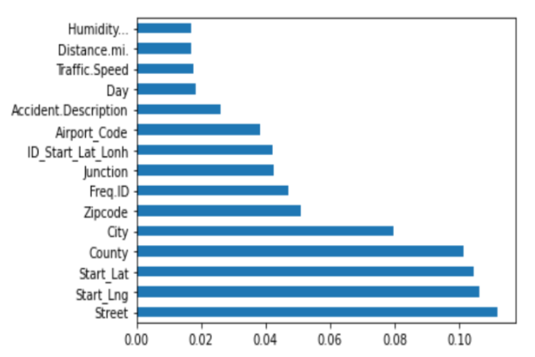
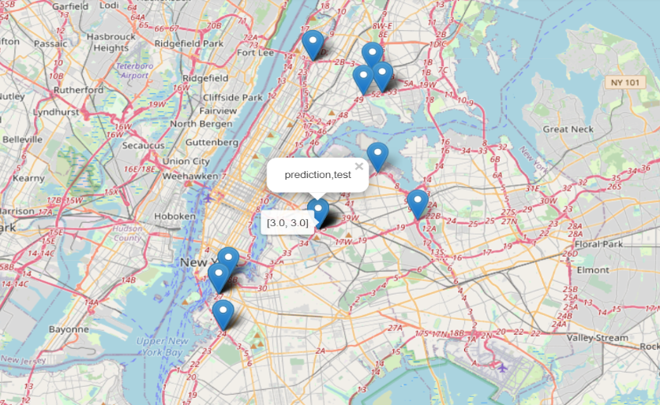
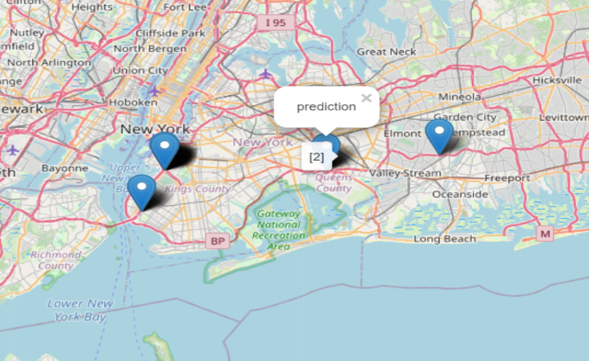
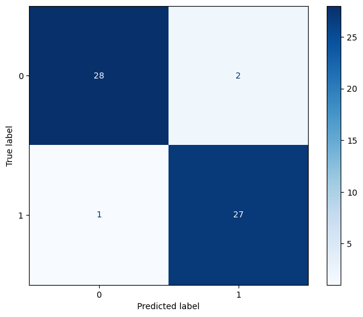

# Road Accident Severity Prediction 
---

<u>Table of contents</u>
=======

<!--ts-->
  - [Problem Statement ](#problem-statement-1)
  - [Methodology](#methodology)
      - [Data Description](#datadescription)
      - [Data Preprocessing](#preprocessing)
      - [Improved SVM Model](#improved)
      - [Visualization](#visualization)
      - [Incremental SVM Model](#incremental)
  - [Results](#results)
<!--te-->

---

## Problem Statement 
This GitHub repository focuses on the critical issue of road accidents, which have become a major global concern and a leading cause of death in many countries. The project aims to address this problem through the use of Machine Learning models, particularly an enhanced Support Vector Machine (SVM) model that predicts accident severity. The project also introduces an incremental SVM model to adapt to newly added data, improving accuracy. By incorporating weather, social, and temporal data as influential factors, the proposed approaches demonstrate substantial accuracy improvements, achieving up to 94.8 percent accuracy compared to baseline methods. Notably, the project emphasizes the importance of scaling as a crucial component for accuracy enhancement, integrating it into the modeling process.

## Methodology 

#### Data Description 

The Dataset utilized for road accidents remembered 49 states for the United States. Since February 2016, information was consistently gathered using an assortment of information suppliers, including different APIs that gave streaming traffic occasion information. The Original Dataset contained 47 attributes with 1.5 million accident records. The Dataset included attributes such as Accident ID which is the unique identifier of an accident, Severity which depicts how severe an accident was where 1 indicates the least severe and 4 the most severe. Speed, humidity percentage, air pressure, visibility, wind direction, and many more factors were included in the dataset. The Dataset also included spatiotemporal attributes. However, the final dataset for the SVM model, which was created after conducting feature extraction, included the 12 most significant factors shown in table below.

  | Attribute | Description |
  | :------------ | :------------ |
  | ID | The unique identifier of an accident |
  | differ HHMM | This represents the difference between the start time and the end time of the accident. |
  | S time | This Shows the accident’s start time in local time. |
  | Month | This indicates the month in which the accident occurred. |
  | Start Lat | The latitude in GPS coordinates of the starting position of an accident. |
  | Start Lng | The longitude in GPS coordinates of the start- ing position of an accident. |
  | Distance.mi. | The extent to which the accident has impacted the road. |
  | Accident.Description | The accident is described in basic language. |
  | Traffic.Speed | This shows the speed of the vehicle |
  | Street | This depicts the street name. |
  | City | This shows the city name |
  | Weather Condition | This depicts the different weather conditions such as rain, snow, thunderstorm, fog, etc |

#### Data Preprocessing 

- <u>Analysing the dataset</u>: This focuses on loading and analysing the different columns present in the dataset. Visual examinations are performed prior to feature extraction to give a view of the data’s basic properties. The dataset used has columns with various data types such as object, Boolean, int64 and float. Also, it includes spatiotemporal columns which help to understand the different accident patterns changing with time and space.

- <u> Handling Null Values</u>: Missing values are common in real-world data, making it unsuitable for use in machine learning models. In this model, the missing and NaN values are handled using the replace function from pandas library and are replaced with ’0’.

- <u> Handling Categorical Variables </u>: Because a machine learning model is entirely based on mathematics and numbers, having a categorical variable in the dataset could cause problems while developing the model. As a result, these categorical attributes must be converted to integers. To do so, we have used LableEncoder() class from sklearn preprocessing library which encodes the values between 0 to n-1.

- <u> Feature Selection </u>: This focuses on minimising the dataset by choosing the best set of features to model with. ExtraTressClassifier from sklearn.essemble has been used which randomises specific decisions, and subsets of data to avoid over learning and over fitting and helps in improving the prediction accuracy. The final set of 12 features is not entirely based on the results of feature selection process as with spatiotemporal data the variables try to dominate other features. Therefore, the final dataset that will be used for modelling is based on the spatiotemporal data behaviour, and analysis of feature selection as it shown in image below. 

  &nbsp;&nbsp;&nbsp;

#### Improved SVM Model 

Once the raw data is preprocessed it can be used for modelling. First, the target variable that is the Severity of an accident (output column) is separated from the input dataset X and stored in another variable y. Next, the dataset is separated into 70 percent training and 30 percent testing dataset using the train test split function from sklearn.model selection library. Training sets are used to fit the data into the model whereas the test sets are used to evaluate the fit in the model. After dividing the dataset a copy of X test dataset is created to retain the original Latitude and Longitude values. Further, the X train and X test data is scaled using StandardScaler() from sklearn.preprocessing. Standardizing is an important step especially when dealing with spatiotemporal data as some variables may dominate over others. It re-scales the distribution of values so that the mean of observed values is 0 and the standard deviation is 1. Usually, scaling is done during the pre processing of the raw data however in our model scaling is executed after the data has been split into training and testing dataset. To perform scaling,first the X train data is fitted and transformed using StandardScaler() object and then using the same object the X test data is transformed. After scaling, we create a support vector classifier and fit the training dataset to train the model. SVM works well in high dimensional spaces because an SVM’s generalisation property is dependent only on a subset of the training data. The SVM classifier has been created using the default values of C, Kernel, and Gamma. C is a regularisation parameter that regulates the trade-off between getting a low error on the training data. The regularization’s intensity is inversely proportional to C therefore the value of C should always be positive. The type of hyperplane utilised to split the data is determined by kernel parameters. The gamma parameter determines how far a single training example has an impact. Once the model training is complete, the predict() method of the svm classifier is used to make the severity predictions. The predict() function takes one input, X test, and returns the learnt value for each object in the array. The prediction values are stored in a new variable named y pred.

#### Visualization 

- <u> Getting the Locations</u>: A new dataframe is created out of the copy of X test variables and the y test and y pred values are merged in that dataframe. Then the dataframe is converted into a new CSV file which is read, and stored in another variable.

- <u> Creating a Map </u>: The folium map is created using the location as the mean of latitude and longitude value. The zoom start parameter is used to set the map’s initial zoom level to 14 and control scale is defined as True which specifies the scale bar for the map. 

- <u> Adding points to Map </u>: Iterating through each row, the location’s latitude and longitude were passed to folium Marker. The popup parameter has been used to input text to be displayed while clicking on a specific location on the map. Also, the tooltip parameter has been used to display both the Prediction and the Test Severity values when hovering over the location as shown in Figure 2.

  &nbsp;&nbsp;&nbsp;
  

#### Incremental SVM Model 

Incremental learning is a machine learning technique in which the learning process occurs whenever new data is presented and modifies what has been learned in response to the data. The most notable distinction between incremental learning and classical machine learning is that it does not presume the existence of a sufficient training set prior to beginning the learning process; instead, training data appear over time. The incremental model presented learns from the previously proposed improved support vector machine model to predict the severity. At first, the data is read in a new CSV file. In addition to this, copy of new CSV is also created to retain the original values of latitude and longitude. Next the data is pre processed and scaled using the same StandardScaler object that was previously used in the improved SVM model. Further, the prediction of the traffic accident severity is done using the improved SVM classifier and the predictions are stored in a new variable. To visualise the prediction value for a specific location on the map, a new dataframe is created from the incremental dataset merged with prediction values. Next, the dataframe is converted into a CSV file which is further read and stored in another variable. After this, an empty folium map is created using the location as the mean of latitude and longitude value. Further, iterating through each map the location points are added to the map. 

## Results 

 the Performance of the improved SVM model was evaluated using a confusion matrix by comparing the actual target values with those predicted by the model. The incremental SVM model is accurate up to 70 percent, while the enhanced SVM model has the highest accuracy of 94.8 percent, calculated using the metrics package from sklearn.

 

  &nbsp;&nbsp;&nbsp;

 
In traditional SVM models scaling is done during the pre processing step however in our model scaling is done after splitting the dataset into training and testing datasets. During scaling, first the input training dataset is fit and transformed using the Standard Scaler object and then the same object is used to transform the input testing dataset.